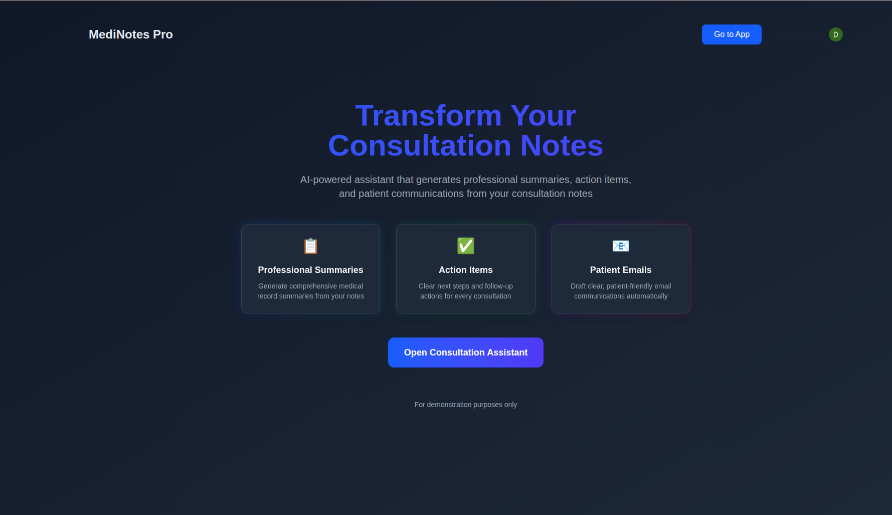
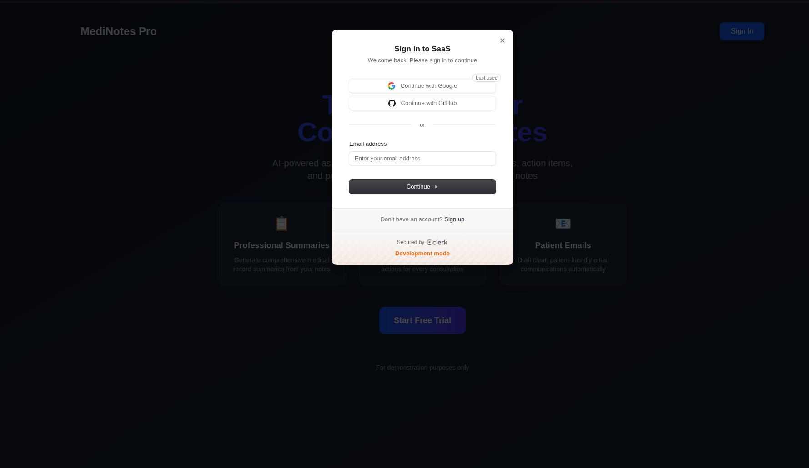
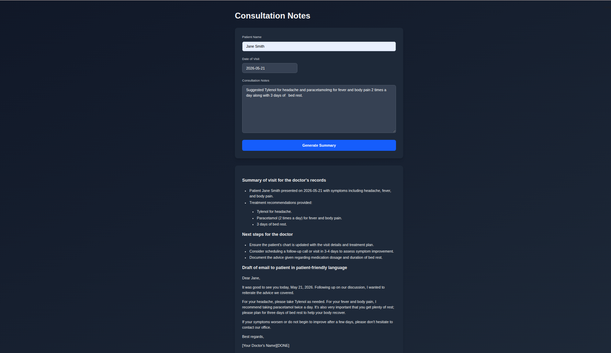
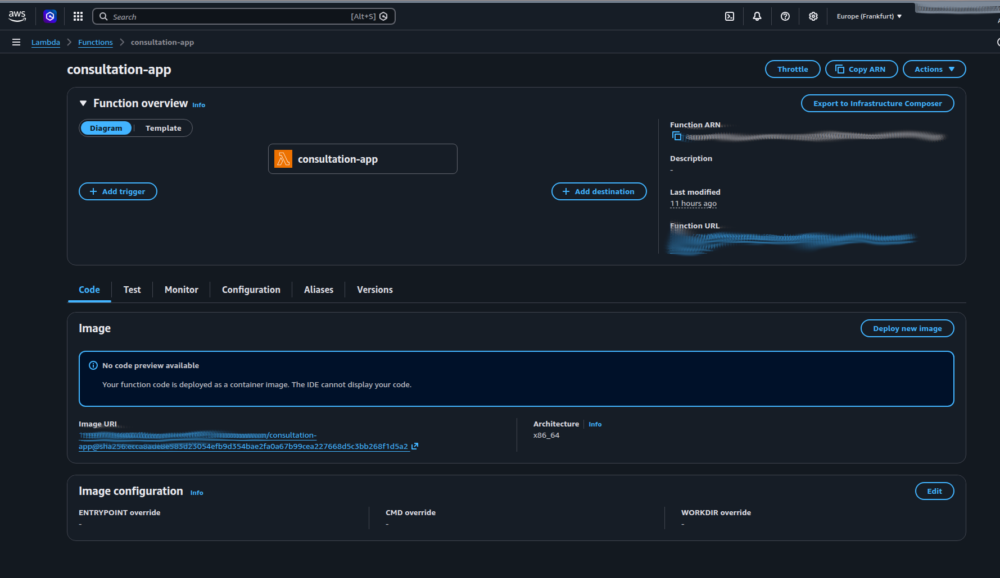

# 🩺 AI Healthcare Consultation Assistant

An end-to-end AI-powered healthcare consultation assistant built using modern GenAI and cloud-native technologies.

This project enables doctors to generate structured patient consultation summaries and patient-friendly follow-up emails using Large Language Models (LLMs) with real-time streaming responses.

Deployed as a production-style full-stack AI application using AWS Lambda, Docker, FastAPI, Next.js, and Clerk authentication.

---

# 🚀 Features

- ✅ Full-stack AI SaaS architecture
- ✅ Real-time LLM streaming responses (SSE)
- ✅ Secure authentication using Clerk
- ✅ Dockerized deployment pipeline
- ✅ AWS Lambda deployment using Lambda Web Adapter
- ✅ FastAPI backend + Next.js frontend
- ✅ Markdown-formatted structured consultation summaries
- ✅ Gemini/OpenAI-compatible API integration
- ✅ Production-ready environment variable configuration
- ✅ Static frontend export served through FastAPI

---

# 🏗️ Architecture

```text
User
   ↓
Next.js Frontend
   ↓
Clerk Authentication
   ↓
FastAPI Backend
   ↓
Gemini/OpenAI API
   ↓
Streaming AI Response (SSE)
```

---

# 🛠️ Tech Stack

## Frontend
- Next.js (Pages Router)
- React
- TypeScript
- Clerk Authentication
- React Markdown

## Backend
- FastAPI
- OpenAI SDK
- Gemini API
- Server-Sent Events (SSE)

## Cloud & Deployment
- Docker
- AWS Lambda
- Lambda Web Adapter
- Amazon ECR
- CloudWatch

## DevOps & Infrastructure
- GitHub
- Git
- Environment-based configuration
- Multi-stage Docker builds

---

# 📸 Application Screenshots

## Login Page
(Add screenshot here)

## AI Consultation Generation
(Add screenshot here)

## AWS Lambda Deployment
(Add screenshot here)

## Docker Deployment
(Add screenshot here)

---

# ⚡ Example AI Output

## Summary of visit for the doctor's records

- Patient presented with persistent cough for two weeks.
- Chest examination was clear.
- Blood pressure was within normal range.
- Likely diagnosis: viral bronchitis.

## Next steps for the doctor

- Monitor symptoms for one week.
- Follow-up if symptoms worsen or persist.

## Draft of email to patient in patient-friendly language

Hi Jane,

Based on today's consultation, your symptoms are most consistent with viral bronchitis. Please continue to rest and stay hydrated. If symptoms worsen or do not improve within a week, please contact the clinic for a follow-up appointment.

---

# 🐳 Docker Deployment

## Build Docker Image

```bash
docker build \
  --platform linux/amd64 \
  --build-arg NEXT_PUBLIC_CLERK_PUBLISHABLE_KEY=$NEXT_PUBLIC_CLERK_PUBLISHABLE_KEY \
  -t consultation-app .
```

## Run Docker Container

```bash
docker run -p 8000:8000 \
  -e CLERK_JWKS_URL=$CLERK_JWKS_URL \
  -e GOOGLE_API_KEY=$GOOGLE_API_KEY \
  consultation-app
```

---

# ☁️ AWS Lambda Deployment

This project was containerized and deployed on AWS Lambda using:

- AWS Lambda
- Lambda Web Adapter
- Docker Containers
- Amazon ECR
- CloudWatch Logs

The deployment supports real-time streaming AI responses through Server-Sent Events (SSE).

---

# 🔒 Authentication

Authentication and session management are implemented using Clerk.

Features include:
- JWT-based authentication
- Secure frontend login
- Backend token validation
- Protected API endpoints

---

# 📡 API Endpoint

## POST `/api/consultation`

Generates:
- Consultation summary
- Next steps
- Patient-friendly follow-up email

### Request Body

```json
{
  "patient_name": "Jane Smith",
  "date_of_visit": "2026-05-20",
  "notes": "Persistent cough for 2 weeks, no fever."
}
```

---

# ⚙️ Environment Variables

Create a `.env` file:

```env
GOOGLE_API_KEY=your_google_api_key
CLERK_JWKS_URL=your_clerk_jwks_url
NEXT_PUBLIC_CLERK_PUBLISHABLE_KEY=your_publishable_key
```

---

# ▶️ Local Development

## Install dependencies

```bash
npm install
pip install -r requirements.txt
```

## Run frontend

```bash
npm run dev
```

## Run backend

```bash
uvicorn server:app --reload
```

---

# 🧠 Key Engineering Concepts Demonstrated

- Full-stack AI system design
- Real-time LLM streaming
- Server-Sent Events (SSE)
- Authentication & JWT validation
- Docker containerization
- Cloud-native deployment
- AWS Lambda serverless architecture
- Multi-stage Docker builds
- AI API orchestration
- Environment-based configuration management

---

# 🚧 Challenges Solved

- SSE streaming over AWS Lambda
- Docker runtime environment variable handling
- Clerk authentication inside Docker containers
- Next.js static export integration with FastAPI
- FastAPI streaming response handling
- Production deployment debugging
- Lambda container deployment setup

---

# 📚 Future Improvements

- Database integration for consultation history
- User dashboards
- PDF export functionality
- Role-based authentication
- Stripe subscriptions
- Multi-model AI routing
- LangGraph agent workflows
- Observability and monitoring

---

# 📸 Screenshots

## Landing Page


## Authentication with Clerk


## AI Consultation Generation


## AWS Lambda Deployment



---


# 👨‍💻 Author

Deepak Lingaraju

Master’s Student in Mechatronics  
Machine Learning | Computer Vision | LLM Engineering | AI Systems

GitHub: https://github.com/DeepuLIN

---

# ⭐ Project Status

✅ Production Deployed  
✅ Dockerized  
✅ AWS Lambda Hosted  
✅ Real-Time Streaming Enabled
